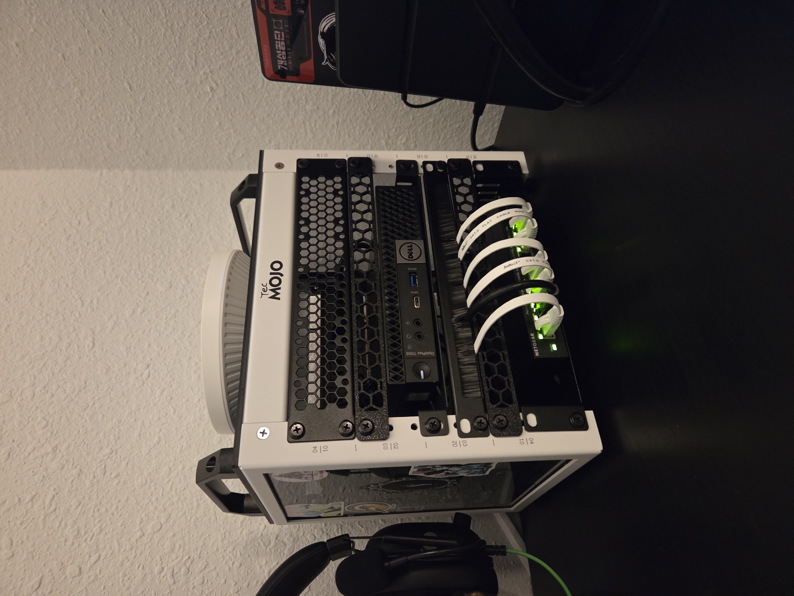
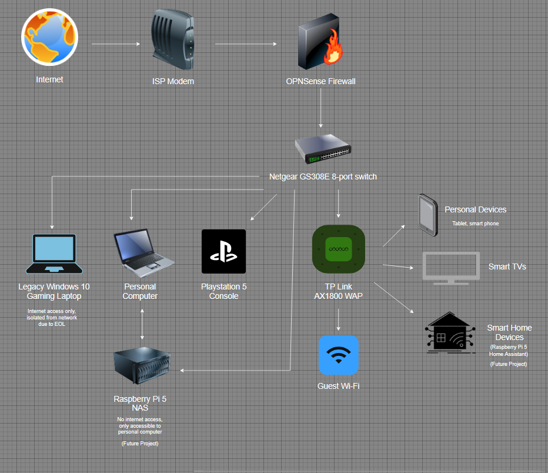

# Home-Networking-Cybersecurity-Project

# Introduction:

Data and information security is at the forefront of concern for everyone today.  As technology continues to evolve, and as virtually all information is in digital form, keeping sensitive and confidential data safe is vital.  These concerns are magnified at the enterprise level, where failure to protect sensitive information can result in heavy financial losses and damage to reputation. 

To protect the Confidentiality, Integrity, and Availability of information, we must adopt a Defense-in-Depth mindset, meaning that we start with security and build in into everything we do at every level.  We don’t want to build a system and then secure it later; we build security as a part of the architecture from the beginning.  This includes Identity and Access Management, where we control who has access to what resources and data, and Separation of Duties, where we make sure that critical tasks are divided between multiple people so that no one can execute high-risk actions alone.

 This separation of powers doesn’t just exist at the level of people, but at the level of the network as well.  Network segmentation can be used as a Compensating Control to mitigate the risk of legacy systems that have reached EOL (End of Life) and cannot be updated any longer. The isolation of internal servers holding sensitive and confidential information from publicly accessible web servers can help keep information private, and multiple Wi-Fi networks for guest and business use can help keep businesses safe as well.

It was with these concepts in mind that I embarked on my home networking project, which I desired to mimic an enterprise environment.  Not only did I wish to add hands-on networking experience to my theoretical knowledge, but over the course of my security training, I realized that I had security vulnerabilities in my own personal setup.  

Two chief concerns in my home network are a gaming laptop that can’t be updated to Windows 11 and is now a legacy system vulnerability, and a future project building a Raspberry Pi 5 NAS (Network Attached Storage).  Ideally, I would simply get a new gaming computer, but that’s not an option right now.  Even at an enterprise level, there may be times when replacing a system isn’t feasible, or even an option in some cases.  These systems need to be isolated from the rest of the network so that they’re usable, but far less of a risk to the rest of the network.  A Raspberry Pi 5 NAS will be like an internal server that we need access to but want kept away from the internet.

(For the sake of Operational Security (OPSEC), any MAC addresses, unique device identifiers, in the screenshots below have been redacted to prevent reconnaissance.) 

_The completed setup in its final location._

# Home Network Architecture:

Before diving into the actual work of setting up the network, I needed to create a roadmap of my desired outcome.  I had the following goals in mind:

* My personal computer should have internet access and be able to access the NAS when desired.
* My legacy gaming computer should have only internet access and be isolated from the rest of the network.
* My Playstation should have the same.
*	The NAS should be accessible only to my personal computer and have no internet or wider network access at all.
*	Finally, I will need a WAP (Wireless Access Point) split into two bands, one for my personal devices and one for my IOT (Internet of Things) devices such as my TV.  This will also allow Wi-fi access for future home automation projects.

For this project, I didn’t put my ISP provided router into bridge mode, thus the ISP Wi-fi is still active and will serve as guest Wi-Fi when applicable.

I used Draw.io to create a visual map of what my network would look like once configured.

_Network architecture.  Note that in the final setup the TV and IOT Wi-Fi are combined, and guest Wi-Fi is the ISP Wi-Fi._

# Step One - OPNSense:

For the firewall I took some time to investigate two platforms, PFSense and OPNSense, ultimately deciding on OPNSense due to its user interface being more appealing to me.  To get started, I downloaded and installed OPNSense onto a spare Dell Optiplex 7050 that I had.  The Dell computer has only one ethernet port, so my network structure uses a ROAS(Router-on-a-Stick) formation.

ROAS is a network setup where a single physical router routs traffic between multiple VLANs (Virtual Local Area Networks) using IEEE 802.1Q encapsulation to manage the traffic over a single trunk line.  While this is cost-effective and simplifies the network architecture, it does have a couple of drawbacks.  First, because all traffic travels through a single link throughput is limited.  Second, it does create a SPOF (Single Point of Failure) which is something I’m not too worried about in my tiny home network but would be a much bigger concern at an enterprise level.

# Step Two - Netgear Gs30E 8-port Managed Switch:

Once the firewall is activated, the next step is setting up the switch with the desired VLANs.  Physical ports are assigned to each VLAN, with 1 port set aside for the trunk to OPNSense, and one for the WAN (Wide Area Network, the internet).  Because my switch has 8 ports, and ultimately, I will only need 7, one is also left open as a management port.

_Each port is assigned a VLAN and the trunk port._

_In order for the switch to appropriately direct traffic, tagging and untagging the correct ports is key._

_It is also viatl to ensure the the PVID table is formatted correctly._
