# Home-Networking-Cybersecurity-Project

# Introduction:

Data and information security is at the forefront of concern for everyone.  As technology continues to evolve, and as virtually all information is in digital form, keeping sensitive and confidential data safe is vital.  These concerns are magnified at the enterprise level, where failure to protect sensitive information can result in heavy financial losses and damage public trust. 

To protect the Confidentiality, Integrity, and Availability of information, we must adopt a Defense-in-Depth mindset, meaning that we _start_ with security and build it in into everything we do at every level.  We don’t want to build a system and then secure it later; we build security as a part of the architecture from the beginning.  This includes Identity and Access Management, where we control who has access to what resources and data, and Separation of Duties, where we make sure that critical tasks are divided between multiple people so that no one person or their account can execute high-risk actions alone.

This separation of powers doesn’t just exist at the level of people, but at the level of the network as well.  Network segmentation can be used as a Compensating Control to mitigate the risk of legacy systems that have reached EOL (End of Life) and cannot be updated any longer. The isolation of internal servers holding sensitive and confidential information from publicly accessible web servers can help keep information private, and separate Wi-Fi networks for guest and business use can help keep businesses safe as well.

It was with these concepts in mind that I embarked on my home networking project, which I desired to mimic an enterprise environment.  Not only did I wish to add hands-on networking experience to my theoretical knowledge, but over the course of my security training, I realized that I had security vulnerabilities in my own personal setup.  

Two chief concerns in my home network are a gaming laptop that can’t be updated to Windows 11 and is now a legacy system vulnerability, and two future projects building a Raspberry Pi 5 NAS (Network Attached Storage) and smart home automation.  Ideally, I would simply get a new gaming computer, but that’s not an option right now.  Even at an enterprise level, there may be times when replacing a system isn’t feasible, or even an option in some cases.  These systems need to be isolated from the rest of the network so that they’re usable, but far less of a risk to the rest of the network.  A Raspberry Pi 5 NAS will be like an internal server that we need access to but want kept away from the internet.

(For the sake of Operational Security (OPSEC), any MAC addresses, unique device identifiers, in the screenshots below have been redacted to prevent reconnaissance.) 

_(The completed setup in its final location.)_

# Home Network Architecture:

Before diving into the actual work of setting up the network, I needed to create a roadmap of my desired outcome.  I had the following goals in mind:

* My personal computer should have internet access and be able to access the NAS when desired. It will also need to access the OPNSense Web UI (user interface) and the WAP (Wireless Access Point)
* My legacy gaming computer should have only internet access and be isolated from the rest of the network.
* My Playstation should have the same.
*	The NAS should be accessible only to my personal computer and have no internet or wider network access at all.
*	Finally, I will need a WAP split into two bands, one for my personal devices and one for my IOT (Internet of Things) devices such as my TV.  This will also allow Wi-fi access for future home automation project smart devices.

For this project, I didn’t put my ISP provided router into bridge mode, thus the ISP Wi-fi is still active and will serve as guest Wi-Fi when applicable.

I used Draw.io to create a visual map of what my network would look like once configured.

_(Network architecture.  Note that in the final setup the TV and IOT Wi-Fi are combined, and guest Wi-Fi is the ISP Wi-Fi.)_

# Step One - OPNSense:

For the firewall I took some time to investigate two platforms, PFSense and OPNSense, ultimately deciding on OPNSense simply due to its user interface being more appealing to me.  To get started, I downloaded and installed OPNSense onto a spare Dell Optiplex 7050 that I had.  The Dell computer has only one ethernet port, so my network structure uses a ROAS(Router-on-a-Stick) formation.

ROAS is a network setup where a single physical router routs traffic between multiple VLANs (Virtual Local Area Networks) using IEEE 802.1Q encapsulation to manage the traffic over a single trunk line.  While this is cost-effective and simplifies the network architecture, it does have a couple of drawbacks.  First, because all traffic travels through a single link throughput is limited.  Second, it does create a SPOF (Single Point of Failure) which is something I’m not too worried about in my tiny home network but would be a much bigger concern at an enterprise level. In certain situations there are trade-offs, and here I chose a more finacially feasible option, knowing the risks I'm accepting along with it.

# Step Two - Netgear GS30E 8-port Managed Switch:

Once OPNSense is activated on its computer, the next step is setting up the switch with the desired VLANs.  Physical ports are assigned to each VLAN, with 1 port set aside for the trunk to OPNSense, and one for the WAN (Wide Area Network, the internet).  Because my switch has 8 ports, and ultimately, I will only need 7, one is also left open as a management port.

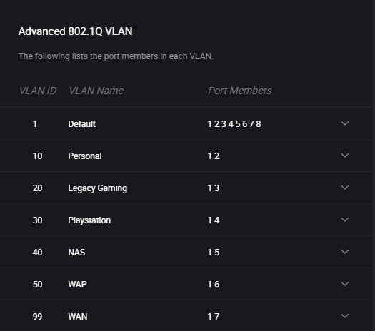

_(Each port is assigned a VLAN and the trunk port.)_

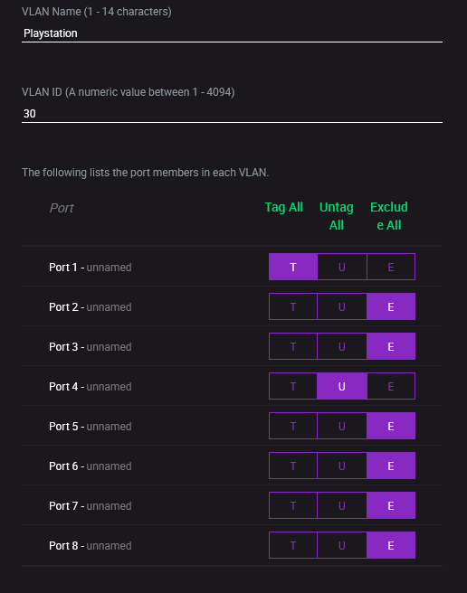

_(In order for the switch to appropriately direct traffic, tagging and untagging the correct ports for each VLAN is key.)_

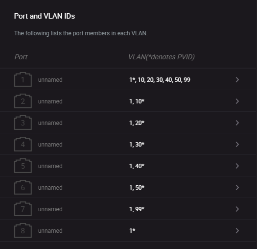

_(It is also vital to ensure the the PVID table is formatted correctly.)_

With the physical highway correctly configured, it is not time to OPNSense configured and the data flowing.

# Step Three - OPNSense:

After the physical lanes are set up on the switch, OPNSense must be told what traffic goes where through interface assignments.  This allows it to know which port is the LAN (Local Area Network), the WAN, and which port matches which VLAN.  Without assignment, the physical hardware is just a box.  By assigning interfaces, I am defining the entry and exit points for data, defining the flow across the network.

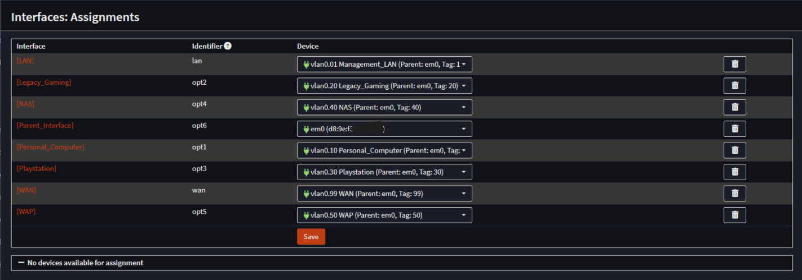

_(Interface assignments)_

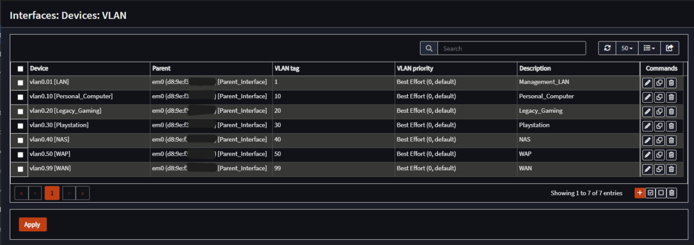

_(VLANs in OPNSense)_

Once this is done, each interface must be individually enabled, and a static local IPv4 address assigned to it.

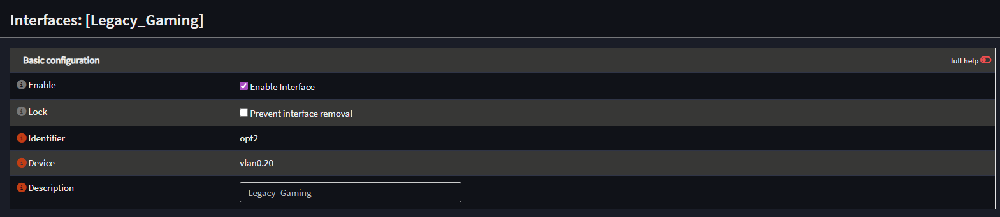

_(Enabling an interface.)_

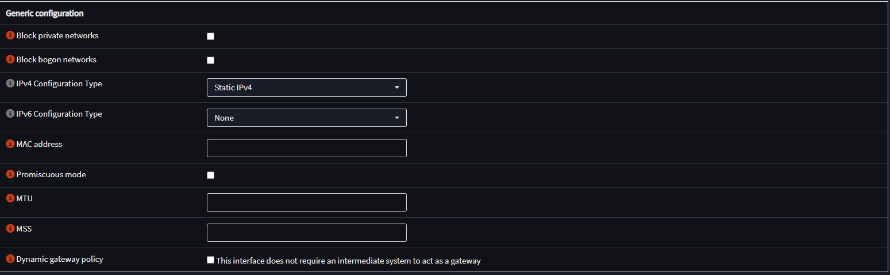

_(Choosing a static IPv4 address.)_

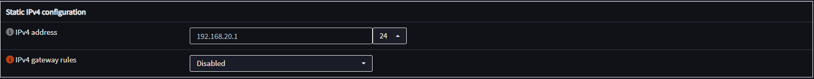

_(Assinging a static IPv4 address.)_

Following the enabling of the interfaces, the subnets for each interface must be created. With subnets created to define the network boundaries, there is now a DHCP pool of IP addresses for the system to assign to connected devices within each VLAN, once the physical setup is finished and devices are connected.  Think of the subnet as the neighborhood, and the IP address range as the house numbers.

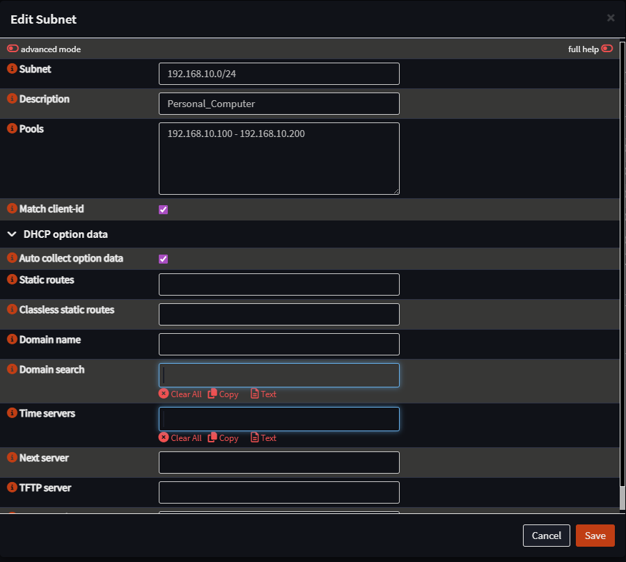

_(Creating a subnet for a VLAN.)_

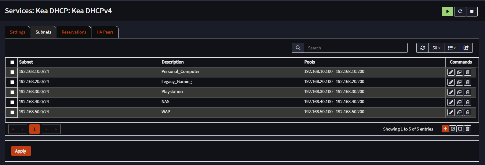

_(The final subnets.)_

With VLAN interfaces created, enabled, and subnets formed, it is now time to begin the final step in OPNSense: creating the firewall rules that will keep the network segmented and safe.

To make creating firewall rules simpler and more efficient, I first created a RFC1918 alias for the local network.  This allows me to create a firewall rule for each device that allows internet access, but blocks access to the rest of the network, keeping it segmented without having to create a block rule for each individual VLAN on each interface.

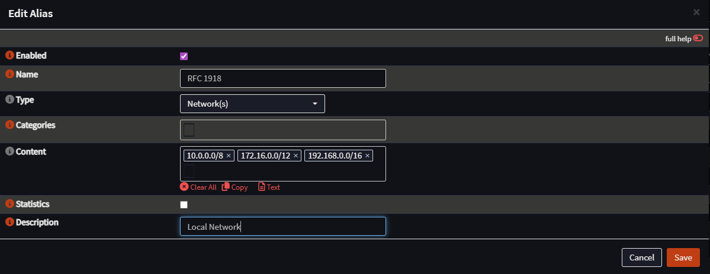

_(Creating the RFC 1918 alias.)_

When creating the rules for each individual interface, the network architecture is kept in mind.  Each VLAN that needs internet access gets a rule allowing DNS access so devices can resolve website names and connect to the internet.

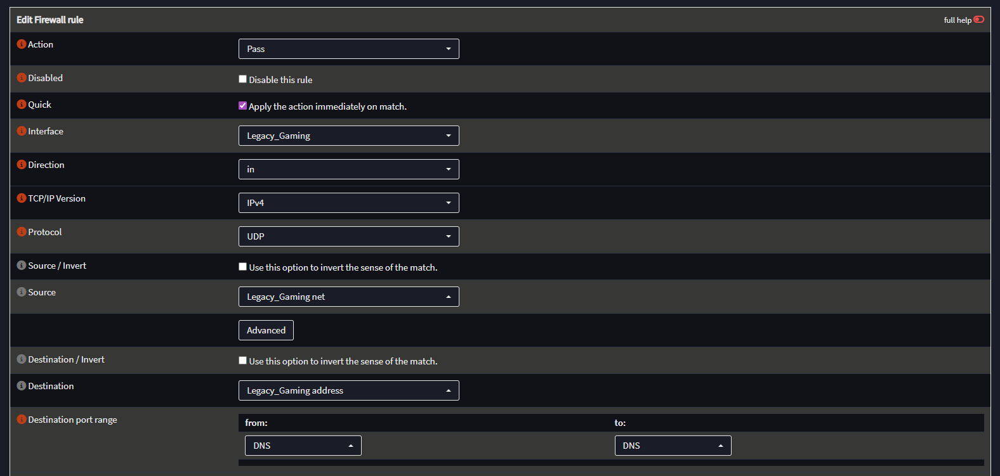

_(DNS rule creation.)_

Each device gets its RFC1918 rule, allowing internet access but denying network access.

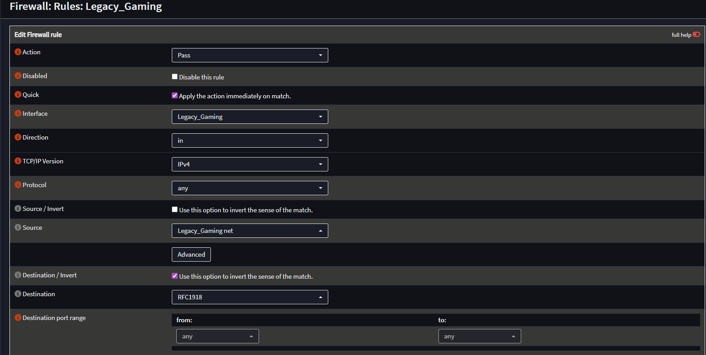

_(Creating the RFC1918 rule for the legacy gaming laptop.)_

The final firewall rule for the legacy gaming laptop looks like so:

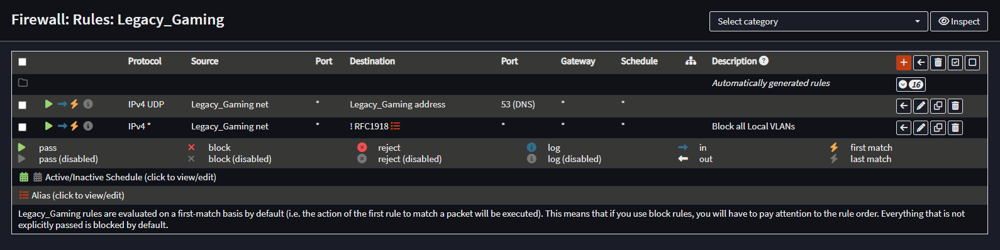

I simply rinse and repeat for each VLAN, keeping the network architecture in mind.  The only exception is my personal computer, which needs a couple of additional rules.  It needs internet, to be blocked from access by the rest of the network, but also needs access to the OPNSense Web UI, the NAS, and the WAP.  Thus, for my personal computer the firewall rules are as follows:

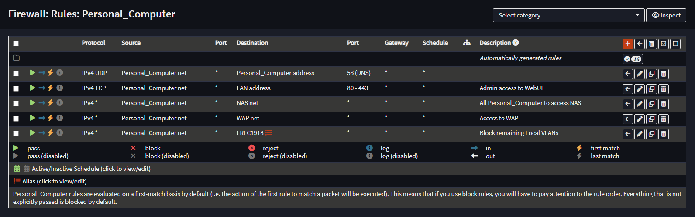

# Step Four - Testing the Network:

No project is complete, _especially a security project_, without testing to ensure that everything is functional.  I do this by running ping tests to verify that what can communicate and can’t communicate are correct.  This proves the network segmentation is working.  Because I have yet to embark on my Raspberry Pi5 NAS project, the only other devices on my network are the legacy laptop and the Playstation 5.  I ran a ping test on both IP addresses to ensure that they were unable to reach my personal computer.

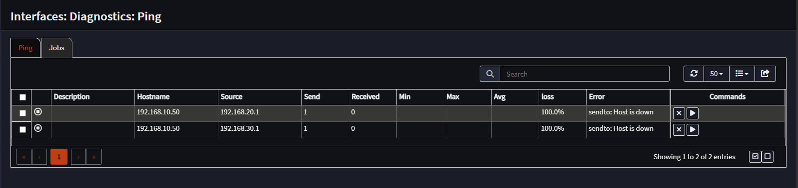

_(100% packet loss proves that neither device can contact my personal computer, showing the network segmentation is working)_

The only thing left to do is verify each connected device has internet access, which is easily verified by the ethernet connection icon on the task bar of a computer and visiting a webpage, and by powering on the Playstation 5 and ensuring I’m greeted with a functioning home screen.

# Conclusion:

With the switch set up, OPNSense VLANS and subnets configured, the physical hardware connected, firewall rules created, internet access verified, and a ping test run to test the network architecture, I have built a stable and secure network. In an enterprise environment the network would ensure that users would have access to only what they need, and not have access to sensitive information outside of their job scope, that guests would have their own Wi-fi, that printers and other devices would be isolated from the rest of the network, etc.  

Proper network configuration, and the use of segmentation are just one of the many tools we can use to protect ourselves, our customers, and our clients, and to ensure compliance with regulatory requirements such as HIPPA or PCI DSS.  A Defense-in-Depth mindset allows us to build security into everything we do from the ground up and allows us to create a strong security posture as we protect the Confidentiality, Integrity, and Accessibility of data.  With security in mind, we can help make the world just a little safer every day.
